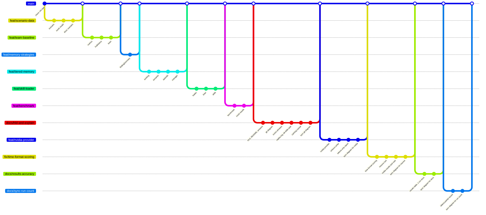

# Git history

One branch per milestone, each merged to `main` with a merge commit. Compare with `git log --graph --oneline`.

```mermaid
gitGraph
    commit id: "chore: init repo"
    branch feat/scenario-data
    commit id: "scenario"
    commit id: "mock model"
    commit id: "docs: scenario"
    checkout main
    merge feat/scenario-data
    branch feat/team-baseline
    commit id: "metrics"
    commit id: "FullHistory"
    commit id: "team"
    checkout main
    merge feat/team-baseline
    branch feat/memory-strategies
    commit id: "RollingSummary"
    checkout main
    merge feat/memory-strategies
    branch feat/tiered-memory
    commit id: "working"
    commit id: "semantic"
    commit id: "episodic"
    commit id: "manager"
    checkout main
    merge feat/tiered-memory
    branch feat/skill-loader
    commit id: "loader"
    commit id: "linter"
    commit id: "skills"
    checkout main
    merge feat/skill-loader
    branch feat/benchmark
    commit id: "benchmark"
    commit id: "mock results"
    checkout main
    merge feat/benchmark
    branch docs/hld-and-explain
    commit id: "HLD, README, answers"
    commit id: "git diagram"
    commit id: "scorer phrases"
    commit id: "replies log, all-skills task"
    commit id: "caching caveat"
    commit id: "sync git diagram"
    checkout main
    merge docs/hld-and-explain
    branch feat/nvidia-provider
    commit id: "nvidia provider"
    commit id: "enforce writer"
    commit id: "tokens-only report"
    commit id: "sync diagram for nvidia"
    checkout main
    merge feat/nvidia-provider
    branch fix/time-format-scoring
    commit id: "time-format scoring"
    commit id: "rescore tool"
    commit id: "nvidia results and note"
    commit id: "sync diagram for rescore"
    checkout main
    merge fix/time-format-scoring
    branch docs/results-accuracy
    commit id: "results table, 1-run docs"
    commit id: "sync diagram for docs"
    checkout main
    merge docs/results-accuracy
    branch docs/sync-run-count
    commit id: "ollama partial record"
    commit id: "sync diagram for run count"
    checkout main
    merge docs/sync-run-count
```
